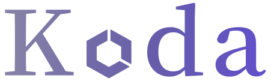

# koda - Kill once; destroy all

Koda is a service that matches a UUID to other ones. In the [Mindtastic authentication system](https://github.com/mindtastic/bouncer) it is used to map a user-known identifier (AccountKey) to a service specific user-id. Each microservice receives its own unique identifier for a certain user, while never getting the actual account key presented.

The name comes from the fact that koda does not yet implement any persistence. Killing the koda service, renders all user-related data stored by other microservicces basically useless.
